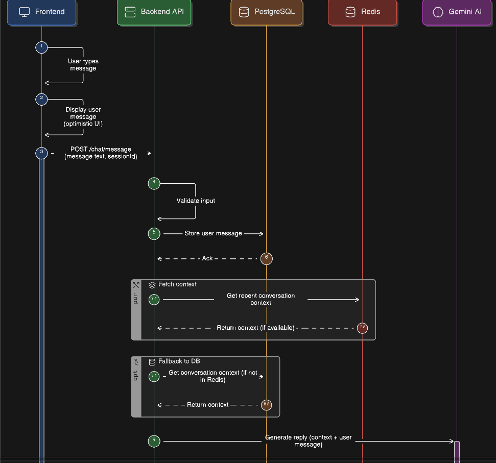

# 🤖 AI Customer Support Chat Agent

A full-stack web application simulating a real customer support chat where users interact with an AI assistant powered by **Google Gemini**.  
Conversations are stored in a Postgres DB and fetched dynamically with conversation history.

---

## 🚀 Tech Stack

| Area | Technology |
|------|------------|
| Frontend | React + TypeScript + Vite, Tailwind CSS, React Query |
| Backend | Node.js + Express + TypeScript |
| Database | PostgreSQL (Neon Serverless) |
| AI Provider | Google Gemini API |
| ORM | Prisma |
| Cache | Redis (Upstash or Local) |

---

## ✨ Features

✔ Real-time chat experience  
✔ Smart, contextual replies using conversation memory  
✔ Typing indicator for AI  
✔ Light/Dark theme toggle  
✔ Chat history persistence via `sessionId`  
✔ “New chat” conversation reset  
✔ Optimistic UI: user messages appear instantly  
✔ Mobile responsive UX  

---

## 🏗️ Architecture Overview

Frontend (React + Vite)
│
Backend API (Express, TypeScript)
POST /chat/message
GET /chat/history/:sessionId
│
├── PostgreSQL (Neon) — stores conversations/messages
│
├── Redis (optional) — fast message history caching
│
└── Gemini AI — generates support responses with memory context

---

[](https://app.eraser.io/workspace/tFXCU2MK1Kfi3kMhjPXy)

---
## Local Development Setup

### Clone Repo

```bash
git clone https://github.com/Irshad-Ahmaed/Chat-Agent
cd Chat-Agent
```

### Backend Setup
```
cd backend
npm install
```
### Create a .env file:
```
PORT=5000
DATABASE_URL="your-neon-postgres-url-here"
GEMINI_API_KEY="your-gemini-api-key-here"
REDIS_URL="redis://your-redis-instance-url"
```

### Prisma DB Init
```
npx prisma migrate dev
npx prisma generate
```

### Rub Server
```
npm run dev
```

## Frontend Setup
```
cd frontend
npm install
npm run dev
```

### Create a .env file:
```
VITE_REACT_API_BASE_URL="http://localhost:5000"
```
---

## LLM Integration (Gemini)

Using:

gemini-2.5-flash

Prompt strategy:

AI is a smart e-commerce assistant

Trained on store policies (shipping/returns/hours)

Retains conversation context from history

Avoids repetitive greetings

Suggests related help when relevant

---

## If I had more time…

🔹 Multi-chat dashboard
🔹 Live chat interface
🔹 Messages Notification
🔹 Product catalog integration (search recommendations)
🔹 Session expiration / cleanup